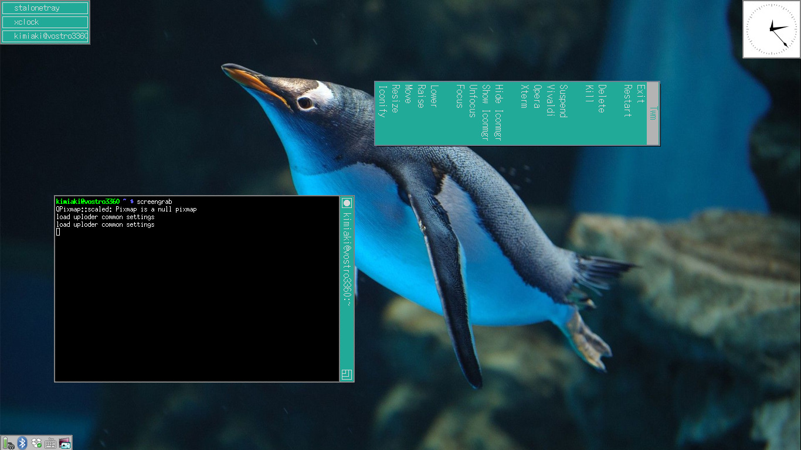

# TWM: including vertical writing title option

Fixed bug which "Vertical Writing Title TWM" published by [Prof. Atsuo Ohki](http://www2.gssm.otsuka.tsukuba.ac.jp/staff/ohki/), and at the same time, followed up the other TWM maintained by [Freedesktop.org](https://cgit.freedesktop.org/xorg/app/twm/).



## Installation

Download twm-ohki-x.x.x.tar.gz from [release](https://github.com/knokmki612/twm-ohki/releases) page, then

```
# tar xvf twm-ohki-x.x.x.tar.gz
# cd twm-ohki-x.x.x
# ./configure && make && make install
```

after do this

```
$ twm
```

will start up.

## Usage

Options which have been added from the original is as follows.

### MenuAtLeft

When this variable is set, pull-down menus including cascated ones  
will be placed at the left side.

### MenuRuns *string*

This variable specifies the direction of menus displayed,  
"t2b" means top to bottom (downward (default)),  
"b2t" bottom to top (upward),  
"r2l" right to left (leftward),  
"l2r" left to right (rightward), respectively.

### TitleAtBottom [{ *win-list* }]

### TitleAtLeft [{ *win-list* }]

### TitleAtRight [{ *win-list* }]
### TitleAtTop [{ *win-list* }]

These variables indicates the position of the title bar of client windows.  
If the optional *win-list* is given, only those windows will  
have the title bar at the specified position.  
You can override the position of the title bar  
at runtime with *f.titlepos* function.

### WarpCursorPos *number* or *string*

This variable specifies the position of the pointer  
when windows are deiconified.  
1 (or NW) means upper left (NorthWest),  
2 (or W) means middle left (West),  
3 (or SW) means lower left (SouthWest),  
4 (or S) means middle bottom (South),  
5 (or SE) means lower right (SouthEast),  
6 (or E) means middle right (East),  
7 (or NE) means upper right (NorthEast),  
8 (or N) means middle top (North).  
The pointer is located middle of the win‐ dow by default.
