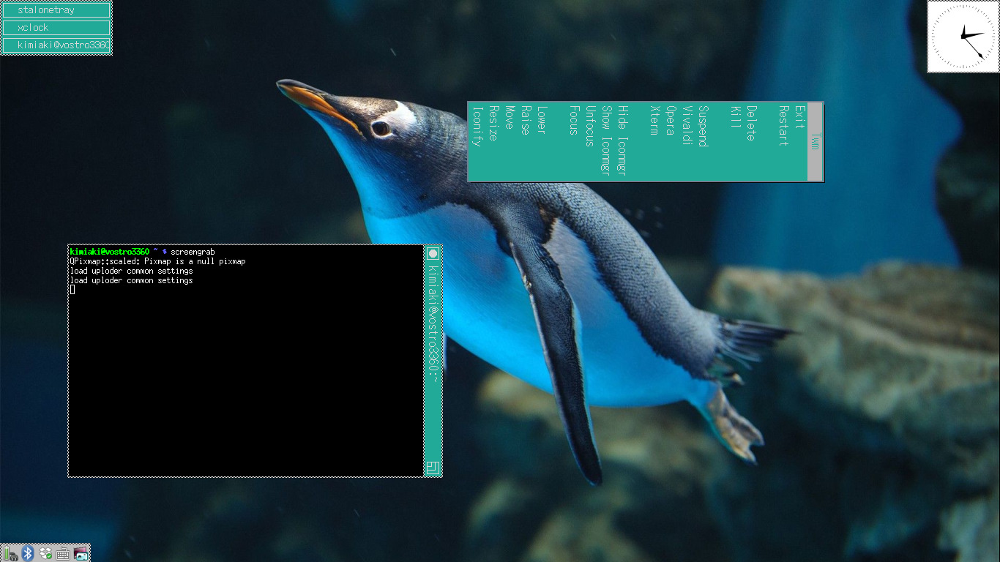

#縦書きタイトルが表示できるTWM
[大木敦雄氏](http://www2.gssm.otsuka.tsukuba.ac.jp/staff/ohki/)が公開している縦書きタイトル twmを、[Freedesktop.org](https://cgit.freedesktop.org/xorg/app/twm/)でメンテナンスされているTWMに追従させつつ、バグ修正などをおこなったものです。



##入れ方
[release](https://github.com/knokmki612/twm-ohki/releases)ページのtwm-ohki-x.x.x.tar.gzをダウンロードし、
```
# tar xvf twm-ohki-x.x.x.tar.gz
# cd twm-ohki-x.x.x
# ./configure && make && make install
```
したのち、
```
$ twm
```
を実行すれば起動できます。

##使い方
オリジナルより追加されているオプションは以下の通りです。

###MenuAtLeft
この変数が設定された場合、プルダウンメニューはマウスポインターに対して、連なったメニューエントリーを左側に表示するようになります。

###MenuRuns *string*
この変数は、表示されるメニューの方向を指定します。
"t2b" は上から下へ(下向き、デフォルト)、
"b2t" は下から上へ(上向き)、
"r2l" は右から左へ(左向き)、
"l2r" は左から右へ(右向き)、にそれぞれ指定します。

###TitleAtBottom [{ *win-list* }]
###TitleAtLeft [{ *win-list* }]
###TitleAtRight [{ *win-list* }]
###TitleAtTop [{ *win-list* }]
これらの変数はウィンドウのタイトルバーの配置を指定します。
オプションの *win-list* を渡した場合、それらのウィンドウのみ配置の指定が反映されます。
*f.titlepos* 関数を使用することで、配置の指定を上書きすることができます。

###WarpCursorPos *number* or *string*
この変数は、ウィンドウをアイコンから復元した際のマウスポインターの位置を指定します。ウィンドウに対して、
"1" または "NW" は左上(NorthWest)、 "2" または "W" は左(West)、
"3" または "SW" は左下(SouthWest)、 "4" または "S" は下(South)、
"5" または "SE" は右下(SouthEast)、 "6" または "E" は右(East)、
"7" または "NE" は右上(NorthEast)、 "8" または "N" は上(North)、にそれぞれ指定します。デフォルトでは、ウィンドウの中心に位置します。
